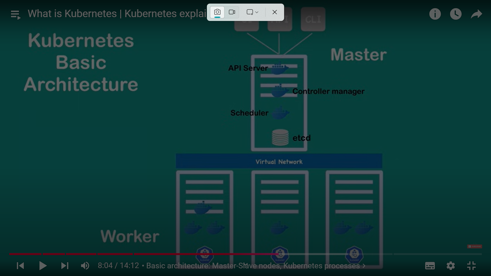
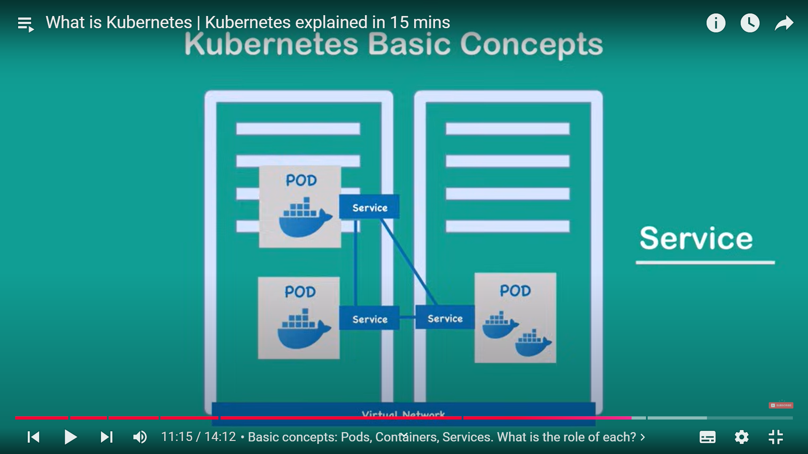
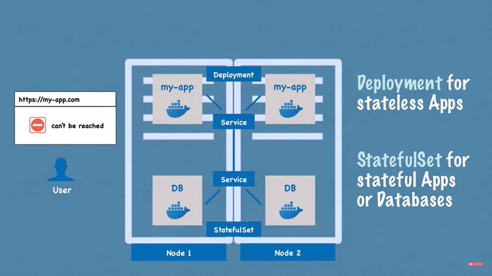
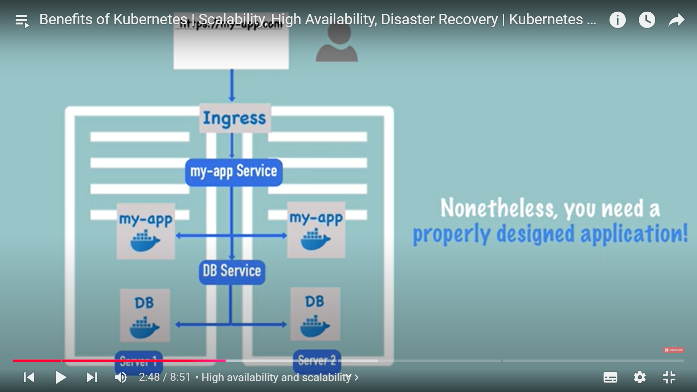
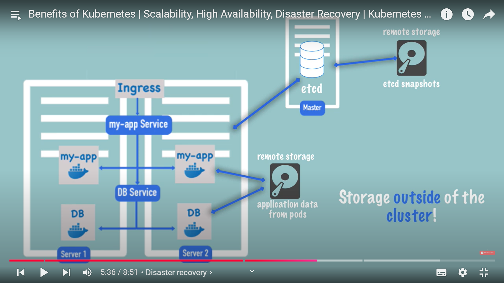

# Kubernetes
- It is an orchestration tool to manage containerized applications.
- It guarantees high availability, scalabity, performance and disaster recovery.

## Architecture

- Master node contains
  - API server
    - It takes our command from UI, client etc.
  - Schedular
    - If command is for scheduling when it will intelligently find the best node for scheduling.
  - Controller manager
    - Keep track of pods, heathy or not
  - etcd
    - storage which is used by master to know count of pods, resource allocation etc.
- POD is smallest unit in kubernetes
  - each pod has containers
  - Each pod is behind a Service
  - Everytime a pod dies, a new IP is assigned to it.
  - To make comuunication easy and delink POD with other pods, we user service.

  

- All configuration goes to Master node through API server.
- Deployment: a template of creating pods in a K8s cluster.

## Basics
 - Node: physical computer
 - POd: smalest unit to interact with in K8s.
   - Each pod usually has a single application container.
   - Each pod is assigned a new address when it comes to life.
   - Hence it cause issue for inter pod communication. Thus service comes into the picture.
 - Service: permanent IP address. IT also works a load balancer.
 - Ingress: All external traffice comes through ingress where it forwards to service IP address.
 - ConfigMap: readble configs
 - Secrets: to user secret data in base64 encoded
 - Volumes: To persist data (DISK)

Master and worker nodes
- 3 processes that runs in every node
  - container runtime, i.e Docker
  - Kubelet : it is used for communication between node and pod.
  - Kube Proxy: intelligently routes requests.

- How to interact with cluster? 
- THrough master node which manages all the worker nodes

## How Kubernetes ensures high availibity and scalibity?
- 

- All components are load balanced hence ensuring high availability.
- If a node dies, the information is collected by controller manager and stored in etcd (current state).

- All data is stored in remote place so we can bring up the system in case of Disaster.
- etcD DATA TELLS worker config and application data tells application state.
- It must be backed up!

Advantages of K8s

- replication is easy
- self healing if pods dies
- smart scheduling based of nodes resources.